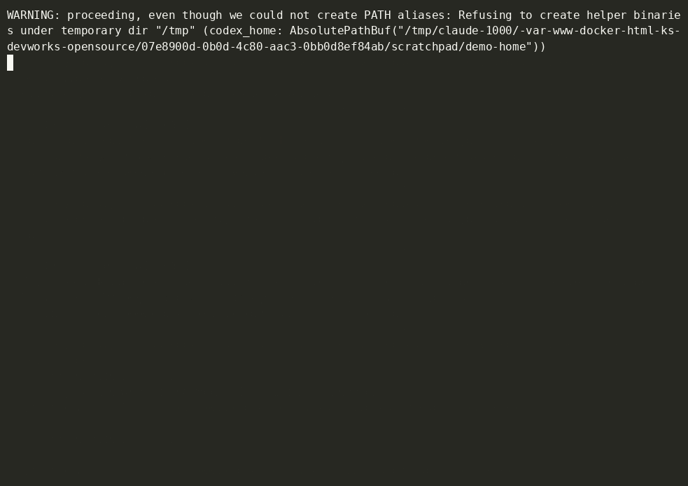

# agent-squiggles

**給 coding agent 的紅色波浪底線。**

[English](README.md)

你在編輯器裡打錯字，下一秒就會看到紅色波浪底線。Codex CLI 改程式時卻沒有這層回饋。它改了一個函式簽名就繼續往下做，要過好幾步才發現其他檔案裡有三個呼叫端編譯不過，甚至根本沒發現。

agent-squiggles 是一個 [Codex hook](https://learn.chatgpt.com/docs/hooks)。每次編輯後，它會問真正的語言伺服器（gopls、TypeScript、pyright）這次改動弄壞了什麼，然後**只把這次編輯新增的錯誤**交給 Codex，包括 agent 從沒打開過的檔案。



<sub>真實的 Codex CLI 操作錄影（gpt-5.6-luna，medium）：Codex 改了簽名，agent-squiggles 在 0.34 秒後回報 <code>main.go</code> 的呼叫壞了，Codex 沒有跑編譯器就把它修好。錄影時使用 <code>--dangerously-bypass-hook-trust</code>，讓 hook 不必經過互動式的 <code>/hooks</code> 審核就能執行。</sub>

這是針對 [openai/codex#8745](https://github.com/openai/codex/issues/8745)（Codex repo 票數最高的 open issue：「LSP integration (auto-detect + auto-install)」）的解法，只用 Codex 現有的 hook API 就能運作。

## Agent 會看到什麼

假設 Codex 在 `greet/greet.go` 幫 `greet.Hello` 加了一個參數，但沒打開 `main.go`。`apply_patch` 一結束，agent 就會收到：

```text
agent-squiggles: your last edit introduced 1 new error (pre-existing problems are not listed).

main.go:10:33: error: not enough arguments in call to greet.Hello; have (string); want (string, bool) [compiler WrongArgCount] (in a file you did not edit)
    fmt.Println(greet.Hello("world"))

These errors come from the language server and were caused by that edit, including the ones in files you did not edit. The code will not compile or type-check until they are fixed: fix them before you finish, or tell the user why they should remain.
```

在我們用 Codex CLI 做的端到端測試裡，agent 回了「The editor reports one expected caller error in `main.go`, so I'm updating that call」，接著就把它修好了。整個過程它沒有跑編譯器，也沒有主動打開 `main.go`。

## 特色

- **只報你弄壞的。** 比對每次編輯前後的診斷，只回報差異。行號用 diff 對應，錯誤只是換了位置不會被重複回報。舊專案裡原本就有 400 個型別錯誤也不會造成雜訊。
- **跨檔錯誤。** 改了簽名導致其他檔案的呼叫端壞掉，一樣抓得到。Go 靠 gopls 的全工作區診斷；TypeScript 與 Python 會找出 import 被改檔案的其他檔案一起檢查。
- **Shell 編輯也算。** `sed -i`、程式碼產生器、`mv`、`rm`，agent 透過 `Bash` 做的改動都會被偵測。做法是在每次工具呼叫的前後，把 git 快照寫進一份私有 index，完全不動你自己的 index、分支和 stash。唯讀指令（`ls`、`rg`、`git diff` 等）會直接略過。
- **快。** 每個工作區有一個背景 daemon 讓語言伺服器保持啟動。編輯前的快照約 6 毫秒，多數檢查在一秒內完成。
- **免設定。** 自動偵測 Go、TypeScript/JavaScript、Python。缺少的語言伺服器會裝進 agent-squiggles 自己的目錄，不會污染全域環境。
- **不擋路。** 報告是以附加脈絡的方式交給模型，工具呼叫本身照樣成功，agent 不會誤以為編輯失敗。想要硬性攔截的話可以改用 `block` 模式。
- **單一靜態執行檔**，用 Go 撰寫，沒有執行期相依。

## 安裝

需要支援 hook 的 Codex CLI、git，以及 Linux 或 macOS（Windows 請用 WSL）。

```sh
curl -fsSL https://raw.githubusercontent.com/wpkc0429/agent-squiggles/main/install.sh | sh
agent-squiggles install
```

這個腳本會從 [Releases](https://github.com/wpkc0429/agent-squiggles/releases) 下載預先編譯好的執行檔，驗證 checksum 後放到 `~/.local/bin`。有裝 Go 的話也可以改用 `go install github.com/wpkc0429/agent-squiggles/cmd/agent-squiggles@latest`。

`install` 會在 `~/.codex/hooks.json` 加入三個 hook，你原本的其他 hook 會保留。它也會為目前 repo 偵測到的語言提議安裝語言伺服器。加上 `--project` 則改寫入 repo 內的 `.codex/hooks.json`。

Codex 在執行新的 hook 前會要求你審核。啟動 `codex` 後執行 `/hooks` 即可信任它們。

隨時可以用這個指令檢查設定狀態：

```sh
agent-squiggles doctor
```

## 支援的語言

| 語言 | 語言伺服器 | 說明 |
| --- | --- | --- |
| Go | `gopls` | 使用 gopls 的全工作區診斷，模組內任何套件壞掉都抓得到。 |
| TypeScript / JavaScript | TypeScript 7 原生（`tsc --lsp`），或 `typescript-language-server` | 專案固定在 TypeScript 6 以下時，用專案自己的 `tsserver`；否則用 TypeScript 7 原生伺服器。 |
| Python | `pyright` 或 `basedpyright` | 會使用專案的 `.venv` / `venv`，並遵循你的 pyright 設定。 |

## 安全模型

Codex 的 hook 在 Codex 沙箱**之外**、以你的使用者權限執行，所以 agent-squiggles 會跟隨 Codex 自己的專案信任判斷（`~/.codex/config.toml` 中的 `trust_level = "trusted"`）：

- **已信任的專案**：可以使用專案內的語言伺服器（`node_modules/typescript`、`.venv`）和 `.agent-squiggles.json`。
- **未信任的專案**：只使用 `PATH` 上或 agent-squiggles 目錄裡的語言伺服器，並忽略專案設定檔。repo 無法決定 hook 要執行什麼指令，也無法傳入 gopls `buildFlags` 這類設定。

所有處理都在本機完成，不會傳送任何資料；只有安裝缺少的語言伺服器時才會用到網路。

## 設定

不設定也能用。要調整時，可以在 repo 加 `.agent-squiggles.json`，或用 `~/.config/agent-squiggles/config.json` 套用到所有 repo；兩者並存時以專案設定為準。可用的鍵請見[英文 README 的 Configuration 一節](README.md#configuration)。

設定環境變數 `AGENT_SQUIGGLES_DISABLE=1`，可以在單次 session 內完全停用。

## 在 CI 也能用

`check` 會比較工作目錄與某個 git revision，有新問題時以 exit code 1 結束，適合放在 pre-commit 或 PR 檢查：

```sh
agent-squiggles check --base origin/main
```

## 限制

- 目前只支援 Linux 和 macOS。
- 要偵測 shell 指令造成的編輯，需要 git repo；沒有 git 時只會檢查 `apply_patch` 的編輯。
- TypeScript 與 Python 的跨檔檢查會追蹤相對 import 和 `tsconfig` 的 `paths` 別名，上限為 `maxDependents` 個檔案。
- 目前只支援 Codex CLI。核心引擎本身不綁定特定 agent，之後會加入其他 agent 的介接。

## 授權

[Apache License 2.0](LICENSE)
